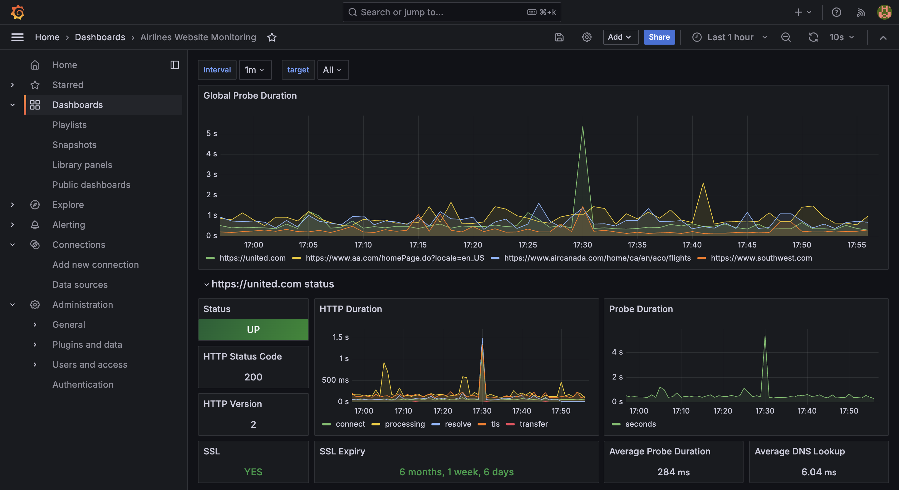

# Airline Website Monitoring



## Overview
This project is dedicated to monitoring the performance and availability of major airline websites using **Prometheus** and **Grafana**. The goal is to gather, analyze, and visualize data to ensure that these websites are operating efficiently and to detect any potential issues that may arise.

## Technologies

- **Prometheus:** For scraping metrics from the airline websites and storing the data.
- **Grafana:** For visualizing the data collected by Prometheus.
- **Docker:** For containerizing the services.

## Background and Motivation

The primary motivation for this project is to validate and demonstrate my knowledge of Grafana and Prometheus. By applying these tools to real-world scenarios such as monitoring websites, I aim to showcase their capabilities in tracking and analyzing critical metrics like website availability, response times, and user activity patterns.

This project also seeks to provide valuable insights into the operational behavior of airline websites and attempt to identify any noticable patterns relating to dynamic pricing. For example, identifying peak usage hours and comparing the prices of a specific flight to understand the scale at which airline ticket pricing works.

## Goals

- **Validating my knowledge:** Demonstrate proficiency in setting up and configuring Prometheus and Grafana for real-time monitoring and data visualization.
- **Monitoring key metrics:** Track crucial metrics such as website availability, response times, and DNS resolution time on major airline websites.
- **Visualizing data:** Create an informative Grafana dashboard that presents real-time and historical data in an easily interpretable format.

## Milestones
- ~~**Phase 1: Initial setup**~~ **[COMPLETE]**
  - ~~Set up a basic Prometheus server + configure Prometheus to scrape metrics from selected airline websites (see `prometheus.yaml`).~~
  - ~~Verify that metrics are being collected and stored correctly.~~

- ~~**Phase 2: Grafana integration**~~ **[COMPLETE]**
  - ~~Set up Grafana and manually connect it to the Prometheus data source.~~
  - ~~Create initial dashboard to visualize basic metrics.~~

- ~~**Phase 3: Automate Grafana dashboard provisioning + fine-tune dashboards**~~ **[COMPLETE]**
  - ~~Configure Grafana provisioning of data source and dashboards.~~
  - ~~Clean up dashboard to visualize key metrics.~~

## Installation & Configuration
1. Clone repo
```bash
  git clone https://github.com/ElAmney/airline-website-monitoring.git
  cd airline-website-monitoring
```

2. Depending on your OS, comment out the incorrect hostname in `prometheus/prometheus.yaml`
```yaml
  # For macOS and Windows
  replacement: host.docker.internal:9115 
  # For Linux
  replacement: localhost:9115
```

3. Start Grafana and Prometheus
```bash
  docker compose up -d
```

4. The Grafana Dashboard is now accessible via: `http://localhost:3000/dashboards`
```bash
  username - admin
  password - admin
```

## References
- [Prometheus Blackbox Exporter](https://github.com/prometheus/blackbox_exporter)
- [Understanding and using the multi-target exporter pattern](https://prometheus.io/docs/guides/multi-target-exporter/)
- [Provision Grafana](https://grafana.com/docs/grafana/latest/administration/provisioning/)